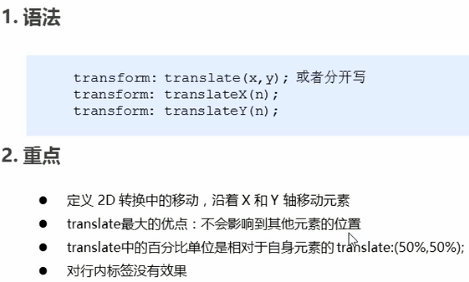
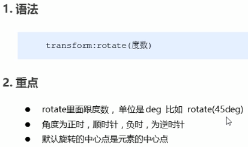
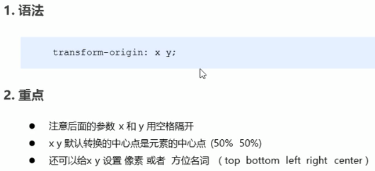
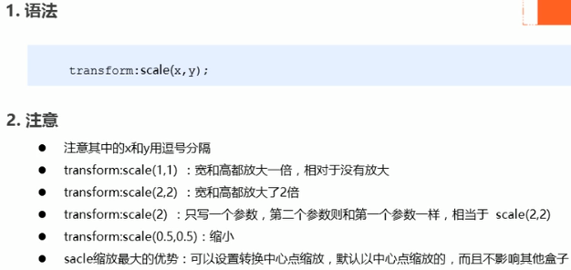
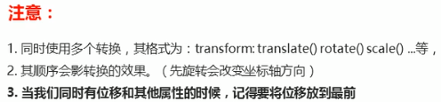
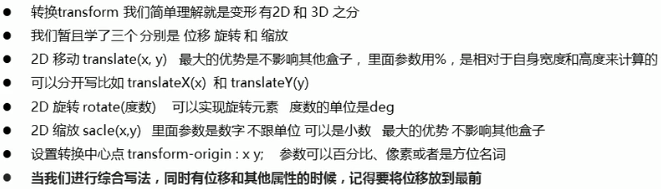
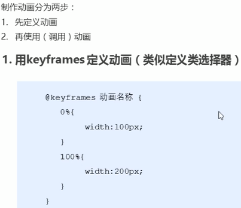
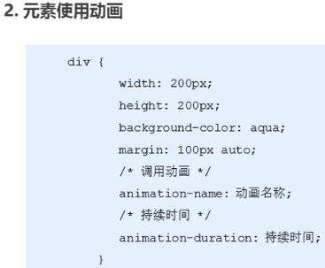

## 2D转换

1. 移动translate
2D移动是2D转换里面的一种功能，可以改变元素在页面中的位置，类似定位。

2. 旋转rotate
2D选择指的是让元素在2维平面内顺时针旋转或者逆时针旋转。

3. 转换中心点transform-origin
我们可以设置元素转换的中心点。

4. 缩放scale
控制元素放大缩小。

5. 2D转换综合写法

6. 总结

## 动画

