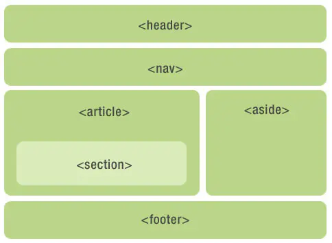

#### label

定义：

+ 为 input 元素定义标注（标记）。
+ 不会向用户呈现任何特殊效果。不过，它为鼠标用户改进了可用性，当在 label 元素内点击文本，就会触发控件，即当用户选择该标签时，浏览器就会自动将焦点转到和标签相关的表单控件上。

用法：

```
<form>
  <label for="male">Male</label>
  <input type="radio" name="sex" id="male" />
  <br />
  <label for="female">Female</label>
  <input type="radio" name="sex" id="female" />
</form>
```


### H5语义标签




#### header

定义：

+ header 元素代表“网页”或“section”的页眉。
+ 通常包含`h1-h6`元素或`hgroup`，作为整个页面或者一个内容块的标题。也可以包裹一节的目录部分，一个搜索框，一个`nav`，或者任何相关logo。
+ 整个页面没有限制header元素的个数，可以为每个内容块增加一个header元素。

用法：

```
<header>
    <hgroup>
        <h1>网站标题</h1>
        <h1>网站副标题</h1>
    </hgroup>
</header>
```

注意：

+ 如果hgroup或h1-h6能自己工作就不要用header。


#### footer

定义：

+ 代表“网页”或“section”的页脚，通常含有该节的一些基本信息，譬如：作者，相关文档链接，版权资料。

用法：

```
<footer>
    KwokPeng
</footer>
```


#### hgroup

定义：

+ 代表“网页”或“section”的标题，当元素有多个层级时，该元素可以将`h1`到`h6`元素放在其内，譬如文章的主标题和副标题的组合。

用法：

```
<hgroup>
    <h1>这是一篇介绍HTML 5语义化标签和更简洁的结构</h1>
    <h2>HTML 5</h2>
</hgroup>
```

注意：

+ 如果只有一个h1-h6标签时不用hgroup。
+ 如果有连续多个h1-h6标签时就用hgroup。
+ 如果有连续多个标题和其他文章数据，h1-h6标签就用hgroup包住，和其他文章元数据一起放入header标签


#### aside

- aside在article内表示主要内容的附属信息，
- 在article之外则可做侧边栏，没有article与之对应，最好不用。
- 如果是广告，其他日志链接或者其他分类导航也可以用

用法：

```
<article>
    <p>内容</p>
    <aside>
        <h1>作者简介</h1>
        <p>小北，前端一枚</p>
    </aside>
</article>
```


#### section

- 表示文档中的节或者段；
- article、nav、aside可以理解为特殊的section，所以如果可以用article、nav、aside就不要用section，没实际意义的就用div

用法：

```
<section>
    <h1>section是啥？</h1>
    <article>
        <h2>关于section</h1>
        <p>section的介绍</p>
        <section>
            <h3>关于其他</h3>
            <p>关于其他section的介绍</p>
        </section>
    </article>
</section>
```


#### article

- 自身独立的情况下：用article
- 是相关内容：用section
- 没有语义的：用div

用法：

```
<article>
    <h1>一篇文章</h1>
    <p>文章内容..</p>
    <footer>
        <p><small>版权：html5jscss网所属，作者：小北</small></p>
    </footer>
</article>
```

