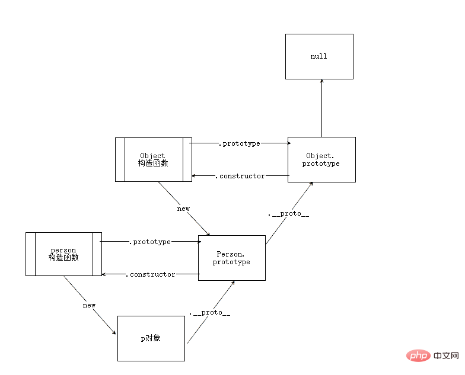

# JS原型与原型链
问题：
+ 什么是原型、原型链
+ 它们有什么特点
+ 它们能做什么
+ 怎么确定它们的关系


### 原型
JavaScript是基于原型的，我们创建的每个函数都有一个prototype属性，这个属性是一个指针，指向一个对象，而这个对象的用途是包含可以由特定类型的所有实例共享的属性和方法。
+ 实例可以共享原型上面的属性和方法。
+ 实例自身的属性会屏蔽原型上面的同名属性，实例上面没有的属性会取原型上面找。

### 原型链
JavaScript中所有的对象都是由它的原型对象继承而来，而原型对象自身也是一个对象，它也由自己的原型对象，这样层层上溯，就形成了一个类似链表的结构，这就是原型链。
+ 所有原型链的终点都是Object函数的prototype属性。
+ Object.prototype指向的原型对象统一拥有原型，不过它的原型是null，而null则没有原型。

### prototype和__proto__的本质区别
prototype是在构造函数上的，而__proto__是在对象上的。

```
  let arr = ["后盾人"];
  let obj = {};
  let a = Object.create(null, {
    name: {
      value: "后盾人"
    }
  })
  console.log(arr);  //有__proto__属性，包括自己共3代（原型链链接3个结点）
  console.log(obj);  //包括自己共2代
  console.log(a);  //完全数据字典对象（只有数据，没有原型关系存在）
```
如果父结点和自己存在有同名方法，则执行自己的
```
  let a = {
    show() {
      console.log("后盾人");
    }
  }
  a.__proto__.show = function() {
    console.log("哈哈哈");
  }
  a.show();  //后盾人
```
