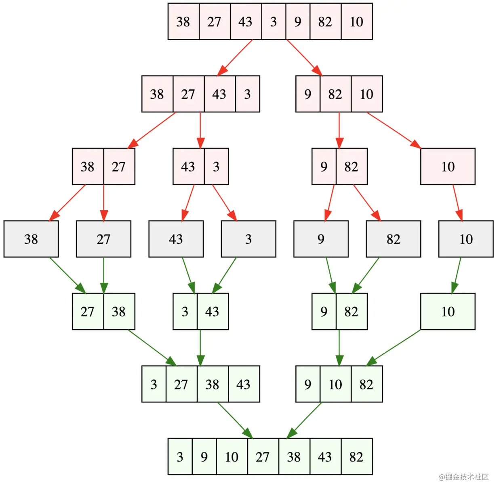

原地排序算法：数组排序前后，不占用额外内存空间。如希尔排序、冒泡排序、插入排序、选择排序、堆排序、快速排序。


### 归并排序（Merge Sort）

> 分支思想。
>
> 稳定排序。
>
> 时间复杂度：O(nlogn)。
>
> 空间复杂度：O(n)。




##### 实现

```
const mergeSort = arr => {
	//采用自上而下的递归方法
	const len = arr.length;
	if(len < 2) {
		return arr;
	}
	// length >> 1 和 Math.floor(len / 2) 等价
	let middle = Math.floor(len / 2),
		left = arr.slice(0, middle),
		right = arr.slice(middle);
	return merge(mergeSort(left), mergeSort(right));
}

const merge = (left, right) => {
	let result = [];
	while(left.length && right.length) {
		// 注意: 判断的条件是小于或等于，如果只是小于，那么排序将不稳定.
		if(left[0] <= right[0]) {
			result.push(left.shift());
		} else {
			result.push(right.shift());
		}
	}
	while(left.length) result.push(left.shift());
	while(right.length) result.push(right.shift());
	return result;
}
```


### 快速排序（Quick Sort）

> 快速排序的特点就是快，而且效率高！它是处理大数据最快的排序算法之一。
>
> 快速排序基本上被认为是相同数量级的所有排序算法中，平均性能最好的。
>
> 时间复杂度：最坏情况 O(n2)，平均时间 O(nlogn)，一般情况快于平均时间。
>
> 空间复杂度：O(logn)。

##### 实现

```
const quickSort = (arr, begin, end) => {
	if(begin < end) {
        let key = arr[begin];
        let i = begin, j = end;
        while(i < j) {
            while(i < j && arr[j] > key) {
                j--;
            }
            if (i < j) {
                arr[i] = arr[j];
                i++;
            }
            while(i < j && arr[i] < key) {
                i++;
            }
            if (i < j) {
                arr[j] = arr[i];
                j--;
            }
        }
        arr[i] = key;
        quickSort(arr, begin, i - 1);
        quickSort(arr, i + 1, end);
	}
}
```


### 希尔排序（Shell Sort）


### 堆排序（Heap Sort）


