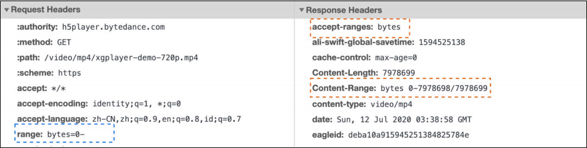

## OSI七层模型

> 开放式系统互连 (Open Systems Interconnection reference，OSI) 参考模型是一种抽象的分层模型。

#### 应用层

它的作用是为应用程序提供服务并规定应用程序中通讯相关的细节。常见的协议有HTTP、FTP、TELNET、SMTP等。

#### 表示层

该层的作用是将应用处理的信息转换为适合网络传输的格式，或者将来自下一层的数据转换为上层能处理的格式。它主要负责数据格式的转换。

#### 会话层

负责在数据传输中设置和维护计算机网络中两台计算机之间的通信连接。

#### 传输层

主要负责向两个主机中进程之间的通信提供服务，起着可靠传输的作用。还有复用和分用功能、提供透明传输、流量控制、差错控制。该层有两个具有代表性的协议：TCP和UDP。数据封装成分段。

#### 网络层

它负责将数据传输到目标地址，因此该层主要负责寻址和路由选择。主要由IP、ICMP两个协议组成。数据封装成分组（数据报）。

#### 数据链路层

该层负责网络寻址、错误侦测和改错。有两个子层：逻辑链路控制子层（LLC）、介质访问控制子层（MAC）。常见的协议有HDLC、PPP、SLIP等。数据前后添加字段封装成帧。

#### 物理层

它负责管理计算机通信设备和网络媒体之间的互通。以比特流的形式传输数据。


## HTTP1.0 和 HTTP1.1 的一些区别

1. 缓存处理
    + 在HTTP1.0中主要使用header里的If-Modified-Since、Last-Modified、Expires来做为缓存判断的标准，HTTP1.1则引入了更多的缓存控制策略例如ETag、If-None-Match、Cach-Control等更多可供选择的缓存头来控制缓存策略。
    
    + 第一次请求
    
      
    
    + 第二次请求相同网页
    
    
    
    > If-Modified-Since由客户端发出，Last-Modified由服务端发出，指被标记文件在服务端最后被修改的时间。
    >
    > Expires告诉客户端数据的指定缓存时间。（缺点是服务器和客户端时钟要严格同步）
    >
    > If-None-Match由客户端发出，ETag由服务端发出，是一个可以与web资源关联的记号（token），用于判断资源内容是否发生改变。
    >
    > HTTP1.1引入Cach-Control来客服Expires头的限制，使用max-age指定组件被缓存多久。（Cache-Control的优先级比Expires高）
    >
    > 强缓存：Expires、Cach-Control
    >
    > 协商缓存：Last-Modified / If-Modified-Since、ETag / If-None-Match
    
2. 带宽优化及网络连接的使用
    + HTTP1.0 中，存在一些浪费带宽的现象，例如客户端只是需要某个对象的一部分，而服务器却将整个对象送过来了，并且不支持**断点续传**功能，HTTP1.1 则在请求头引入了 **range 头域**，它允许只请求资源的某个部分，即返回码是 206（Partial Content），这样就方便了开发者自由的选择以便于充分利用带宽和连接。
    
      
    
      ```
      Request:
      	range - 判断后端是否支持断点续传
      Response:
      	accept-ranges - 单位
      	Content-length - 总长度
      	Content-Range - 当前传输数据长度
      ```
    
      
    
3. 错误通知的管理
    + 在 HTTP1.1 中新增了 24 个错误状态响应码，如 409（Conflict）表示请求的资源与资源的当前状态发生冲突；410（Gone）表示服务器上的某个资源被永久性的删除。
    
4. Host 头处理
    + 在 HTTP1.0 中认为每台服务器都绑定一个唯一的 IP 地址，因此，请求消息中的URL并没有传递主机名（hostname）。但随着虚拟主机技术的发展，在一台物理服务器上可以存在多个虚拟主机（Multi-homed Web Servers），并且它们共享一个 IP 地址。HTTP1.1 的请求消息和响应消息都应支持 **Host 头域**，且请求消息中如果没有 Host 头域会报告一个错误（400 Bad Request）。
    
    
    
5. 长连接
    + HTTP 1.1 支持长连接（PersistentConnection）和请求的流水线（Pipelining）处理，在一个TCP连接上可以传送多个 HTTP 请求和响应，减少了建立和关闭连接的消耗和延迟，在 HTTP1.1 中默认开启 Connection： keep-alive，一定程度上弥补了 HTTP1.0 每次请求都要创建连接的缺点。


## SPDY：HTTP1.x的优化

1. 降低延迟
    + 针对HTTP高延迟的问题，SPDY优雅的采取了多路复用（multiplexing）。多路复用通过多个请求stream共享一个tcp连接的方式，解决了HOL blocking的问题，降低了延迟同时提高了带宽的利用率。
2. 请求优先级（request prioritization）
    + 多路复用带来一个新的问题是，在连接共享的基础之上有可能会导致关键请求被阻塞。SPDY允许给每个request设置优先级，这样重要的请求就会优先得到响应。比如浏览器加载首页，首页的html内容应该优先展示，之后才是各种静态资源文件，脚本文件等加载，这样可以保证用户能第一时间看到网页内容。
3. header压缩
    + 前面提到HTTP1.x的header很多时候都是重复多余的。选择合适的压缩算法可以减小包的大小和数量。
4. 基于HTTPS的加密协议传输
    + 大大提高了传输数据的可靠性。
5. 服务端推送（server push）
    + 采用了SPDY的网页，例如我的网页有一个sytle.css的请求，在客户端收到sytle.css数据的同时，服务端会将sytle.js的文件推送给客户端，当客户端再次尝试获取sytle.js时就可以直接从缓存中获取到，不用再发请求了。


## HTTP2.0和SPDY的区别

+ HTTP2.0 支持明文 HTTP 传输，而 SPDY 强制使用 HTTPS。
+ HTTP2.0 消息头的压缩算法采用 HPACK，而非 SPDY 采用的 DEFLAT。


## HTTP2.0和HTTP1.X相比的新特性

1. 新的二进制格式（Binary Format），
    + HTTP1.x 的解析是基于文本。基于文本协议的格式解析存在天然缺陷，文本的表现形式有多样性，要做到健壮性考虑的场景必然很多，二进制则不同，只认 0 和 1 的组合。基于这种考虑 HTTP2.0 的协议解析决定采用二进制格式，实现方便且健壮。
2. 多路复用（MultiPlexing）
    + 即连接共享，即每一个 request 都是用作连接共享机制的。一个 request 对应一个 id，这样一个连接上可以有多个 request，每个连接的 request 可以随机的混杂在一起，接收方可以根据 request 的 id 将 request 再归属到各自不同的服务端请求里面。
3. header压缩
    + 如上文中所言，对前面提到过 HTTP1.x 的 header 带有大量信息，而且每次都要重复发送，HTTP2.0 使用 encoder 来减少需要传输的 header 大小，通讯双方各自 cache 一份 header fields 表，既避免了重复 header 的传输，又减小了需要传输的大小。
4. 服务端推送（server push）
    + 同 SPDY 一样，HTTP2.0 也具有 server push 功能。


## 请求类型


+ OPTIONS: 用于请求获得由 Request-URI 标识的资源在请求/响应的通信过程中可以使用的功能选项。通过这个方法，客户端可以在采取具体资源请求之前，决定对该资源采取何种必要措施，或者了解服务器的性能。
+ PATCH	是对 PUT 方法的补充，用来对已知资源进行局部更新。


#### 请求类型

+ get
+ post
+ put
+ delete
+ head
+ options
+ patch


## GET 和 POST 的区别

> 区别主要是语义上的区别，本质上都是TCP请求。

+ 从**缓存**的角度，GET 请求会被浏览器主动缓存下来，留下历史记录，而 POST 默认不会。
+ 从**编码**的角度，GET 只能进行 URL 编码，只能接收 ASCII 字符，而 POST 没有限制。
+ 从**参数**的角度，GET 一般放在 URL 中，因此不安全，POST 放在请求体中，更适合传输敏感信息。
+ 从**幂等性**的角度，GET是幂等的，而POST不是。(幂等表示执行相同的操作，结果也是相同的)
+ 从 **TCP** 的角度，GET 请求会把请求报文一次性发出去，而 POST 会分为两个 TCP 数据包，首先发 header 部分，如果服务器响应 100(continue)， 然后发 body 部分。(火狐浏览器除外，它的 POST 请求只发一个 TCP 包)


## 状态码

+ 1xx：表示目前是协议处理的中间状态，还需要后续操作。
    + 101：Switching Protocols，在 HTTP 升级为 WebSocket 的时候，如果服务器同意变更，就会发送状态码 101.
+ 2xx：表示成功状态。
    + 200：OK，成功状态码，通常在响应体中放有数据。
    + 204：No Content，与 200 含义相同，但响应头后没有 body 数据。
    + 206：Partial Content，表示部分内容，应用场景为 HTTP 分块下载和断点续传，同时会带上响应头字段 Content-Range。
+ 3xx：重定向状态，资源位置发生变动，需要重新请求。
    + 301：Moved Permanently，即永久重定向，浏览器会做缓存优化；对应着 302 Found，即临时重定向。
    + 304：Not Modified，当协商缓存命中时会返回这个状态码。
+ 4xx：请求报文有误。  
    + 400：Bad Request，并不知道哪里出错。
    + 403：Forbidden，服务器禁止访问，原因有很多，比如法律禁止、信息敏感。
    + 404：Not Found，资源未找到。
    + 405：Method Not Allowed，请求方法不被服务器端允许。
    + 406：Not Acceptable，资源无法满足客户端的条件。
    + 408：Request Timeout，服务器等待了太长时间。
    + 409：Conflict，多个请求发生了冲突。
    + 413：Request Entity Too Large，请求体的数据过大。
    + 414：Request-URI Too Large，请求行里的 URI 太大。
    + 429：Too Many Request，客户端发送的请求过多。
    + 432：Request Header Fields Too Large，请求头的字段内容太大。
+ 5xx：服务器端发生错误。
    + 500：Internal Server Error，服务器出错，但不知道出了啥错。 
    + 501：Not Implemented，表示客户端请求的功能还不支持。
    + 502：Bad Gateway，服务器自身正常，但访问的时候出错了，具体什么错误不清楚。
    + 503：Service Unavailable，表示服务器当前很忙，暂时无法响应服务。
    + 505：HTTP版本不支持。


## URI 和 URL

URI, 全称为(Uniform Resource Identifier), 也就是统一资源标识符，它的作用很简单，就是区分互联网上不同的资源。

但是，它并不是我们常说的网址, 网址指的是URL, 实际上URI包含了URN和URL两个部分，由于 URL 过于普及，就默认将 URI 视为 URL 了。


+ **scheme** 表示协议名，比如 http, https, file 等等。后面必须和 **://** 连在一起。
+ **user:passwd@** 表示登录主机时的用户信息，不过很不安全，不推荐使用，也不常用。
+ **host:port** 表示主机名和端口。
+ **path** 表示请求路径，标记资源所在位置。
+ **query** 表示查询参数，为 **key=val** 这种形式，多个键值对之间用 **&** 隔开。
+ **fragment** 表示 URI 所定位的资源内的一个锚点，浏览器可以根据这个锚点跳转到对应的位置。

例：
```
https://www.baidu.com/s?wd=HTTP&rsv_spt=1
```


### 请求报文

​		HTTP请求报文主要由请求行、请求头部、请求正文组成。

+ 请求行：请求方法、URL以及协议版本
+ 请求头部：由多个头部字段和值组成
+ 请求正文：可选部分


### 响应报文

​		HTTP响应报文主要由状态行、响应头部、响应正文组成。

+ 状态行：协议版本、状态码、状态码描述
+ 响应头部：由多个头部字段和值组成
+ 响应正文：可选部分


### URI、URL、URN的区别

URI全名为Uniform Resource Indentifier（统一资源标识），用来唯一的标识一个资源，是一个通用的概念，URI由两个主要的子集URL和URN组成。

URL全名为Uniform Resource Locator（统一资源定位），通过描述资源的位置来标识资源。

URN全名为Uniform Resource Name（统一资源命名），通过资源的名字来标识资源，与其所处的位置无关，这样即使资源的位置发生变动，其URN也不会变化。
